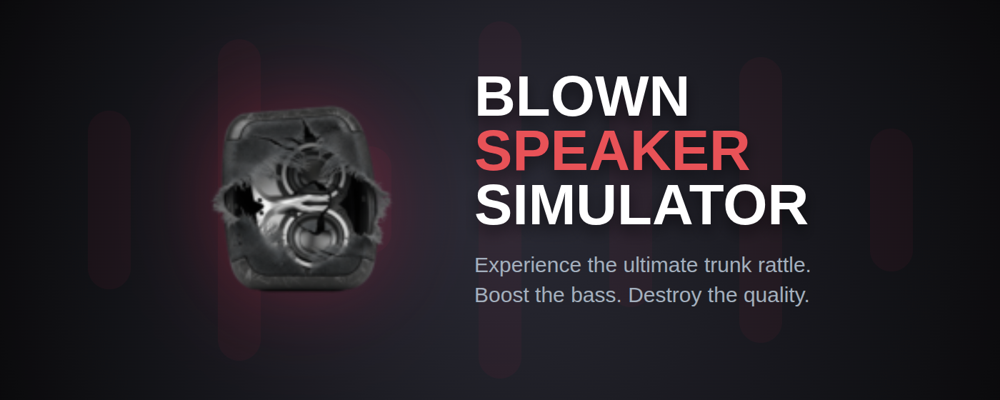
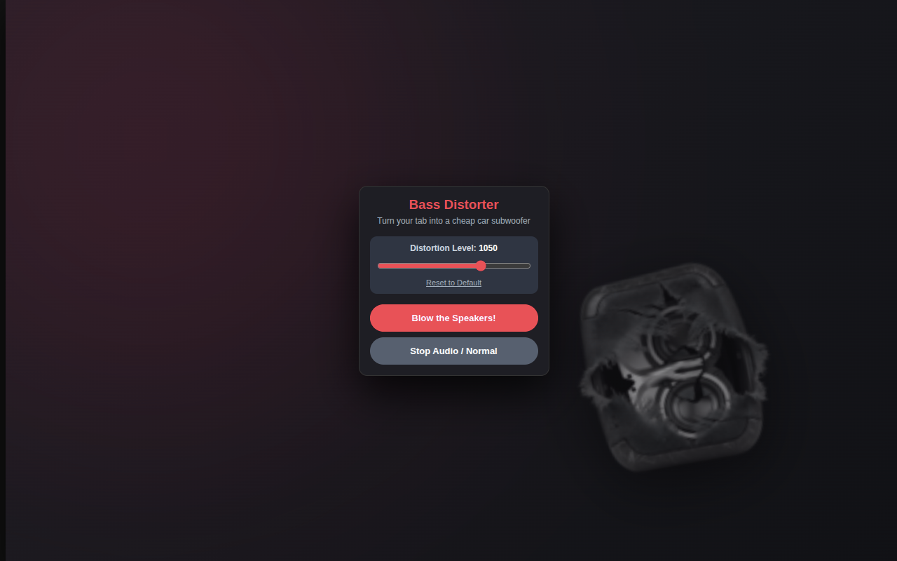

  
  
  # Blown Speaker Simulator
  
  *A Chrome extension utilizing the Web Audio API to simulate hardware speaker distortion.*

---

## Overview

Blown Speaker Simulator is a Chrome extension that manipulates the audio output of the active browser tab. It leverages the Web Audio API to isolate low-frequency signals, apply a heavy gain stage (+28dB), and introduce severe wave-shaping distortion. The result is a real-time digital replication of a degraded, rattling audio setup.

The project is built entirely with Vanilla JavaScript and strictly adheres to Manifest V3 guidelines, utilizing the Offscreen API for background audio processing.

  

## Technical Features

* **Real-Time Audio Processing:** Intercepts the audio stream via `chrome.tabCapture` and processes it through a custom audio graph without perceptible latency.
* **Wave-Shaping Distortion:** Utilizes a mathematically generated curve on a `WaveShaperNode` to digitally clip and degrade the signal.
* **Dynamic Adjustment:** Users can control the distortion intensity in real-time. Preferences are persisted locally using the `chrome.storage` API.
* **Manifest V3 Architecture:** Audio context operations are delegated to a persistent offscreen document, complying with modern Chrome service worker restrictions.

## Installation

### From Source (Developer Mode)

1. Clone or download this repository.
2. Open Google Chrome and navigate to `chrome://extensions/`.
3. Enable **Developer mode** in the top right corner.
4. Click **Load unpacked** and select the extension directory.

  

## Usage

1. Navigate to a tab with active audio playback.
2. Open the extension popup.
3. Click **Blow the Speakers!** to initialize the audio context and apply the filter.
4. Adjust the slider to modify the distortion curve dynamically.
5. Click **Stop Audio / Normal** to release the audio stream and restore original playback.

---

## Volume Warning & Safety

This extension applies an extreme digital gain (+28dB) prior to the hard-clipping stage. This causes the output to peak at maximum digital levels, which can result in sudden, exceptionally loud audio.

To prevent hardware damage or sudden volume spikes, **reduce the media player's internal volume (e.g., the YouTube volume slider) to 20-30%** before activating the extension. Rely on your operating system's master volume for safe listening levels.

## License

Distributed under the MIT License. See `LICENSE` for more information.